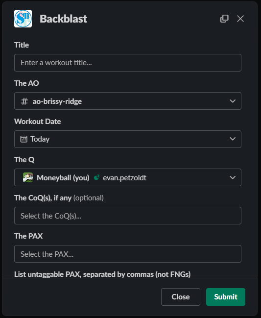

# Slackblast

[](https://github.com/psf/black)

Slackblast is a simple application you can get up and running in your Slack environment that will pop up a simple Backblast form for someone to fill out in the Slack App (mobile or desktop or web) when they type `/slackblast`, `/backblast`, or even `/preblast`. Slackblast interfaces with your PAXminer database directly, and its posts do not need to be scraped by PAXminer (PAXminer will ignore them).

This is my fork and revamp of the [original Slackblast](https://github.com/F3Nation-Community/slackblast) made by the awesome HIMs from that project. This version can serve any number of regions and runs on AWS Lambda - installation is as simple as a [simple link click](#getting-started-), without the need for you to get your own server up and running.

When the user types `/slackblast`, `/backblast`, or `/preblast` and hits send, a window like the one below will pop up:



# Getting started

Installation to your Slack Space is simple:
1. Click [this link](https://n1tbdh3ak9.execute-api.us-east-2.amazonaws.com/Prod/slack/install) from a desktop computer
2. Make sure to select your region in the upper right if you are signed into multiple spaces
3. To change email settings (and more to come!), you will need to run `/config-slackblast` and select your region's PAXminer database so Slackblast knows which region to write to

To use, simply type `/slackblast`, `/backblast` or `/preblast` from any channel and a form should come up.
                                                                         
# Slack App Configuration (email)

If you'd like to enable Slackblast for sending an email containing your backblast, type `/config-slackblast` to change your region's email settings and defaults. Follow the instructions on the form that follows.

## Create Posts by email

Wordpress allows you to send a post to a special address via email and it will convert it to a post. If you are not using hosted wordpress, then you can create a dedicated gmail or other account and use this address.

# Contributing

Slackblast is in active development, and I welcome any and all help or contributions! Feel free to leave an Issue with bugs or feature requests, or even better leave us a Pull Request.

## Local Development

If you'd like to contribute to Slackblast, I highly recommend setting up a local development environment for testing. Below are the steps to get it running (I did this in unix, YMMV on OSX or Windows):

1. Clone the repo:
```sh
git clone
```
2. Install the [AWS Serverless Application Model (SAM) CLI](https://docs.aws.amazon.com/serverless-application-model/latest/developerguide/install-sam-cli.html)
3. Set up a local database (code & instructions coming)
4. Create the Slack bot: 
    1. Navigate to [api.slack.com]()
    2. Click "Create an app"
    3. Click "From a manifest", select your workspace
    4. Paste in the manifest below
    5. After creating the app, you will need a couple of items: first, copy and save the Signing Secret from Basic Information. Second, copy and save the Bot User OAuth Token from OAuth & Permissions

```yaml
display_information:
  name: slackblast-dev # feel free to change this
  description: An invokable form to produce properly-formatted backblasts and preblasts
  background_color: "#000000"
features:
  bot_user:
    display_name: slackblast-dev # feel free to change this
    always_online: true
  slash_commands:
    - command: /slackblast
      url: https://YOUR_URL.ngrok.io/slack/events # You'll be editing this
      description: Launch backblast template
      should_escape: false
    - command: /preblast
      url: https://YOUR_URL.ngrok.io/slack/events # You'll be editing this
      description: Launch preblast template
      should_escape: false
    - command: /config-slackblast
      url: https://YOUR_URL.ngrok.io/slack/events # You'll be editing this
      description: Configures your region's instance of slackblast (email settings, etc)
      should_escape: false
    - command: /backblast
      url: https://YOUR_URL.ngrok.io/slack/events # You'll be editing this
      description: Launch backblast template
      should_escape: false
oauth_config:
  redirect_urls:
    - https://YOUR_URL.ngrok.io/slack/install # You'll be editing this
  scopes:
    bot:
      - channels:read
      - chat:write
      - chat:write.customize
      - chat:write.public
      - commands
      - im:write
      - team:read
      - users:read
settings:
  interactivity:
    is_enabled: true
    request_url: https://YOUR_URL.ngrok.io/slack/events
  org_deploy_enabled: false
  socket_mode_enabled: false
  token_rotation_enabled: false
```


5. Back to your project, create a `env.json` file at the root of the directory. The file should take the format (you will need to replace most of the values):
```json
{
  "Parameters": {
    "SLACK_SIGNING_SECRET": "SIGNING_SECRET_FROM_ABOVE",
    "SLACK_BOT_TOKEN": "BOT_TOKEN_FROM_ABOVE",
    "DATABASE_HOST": "localhost",
    "ADMIN_DATABASE_USER": "local_user",
    "ADMIN_DATABASE_PASSWORD": "local_password",
    "ADMIN_DATABASE_SCHEMA": "slackblast",
    "PASSWORD_ENCRYPT_KEY": "ASK_MONEYBALL_FOR_THIS"
  }
}
```
  - Small note: I had to use my local ip address for `DATABASE_HOST`, not "localhost"
6. Install ngrok and run the following command from your terminal:
```sh
ngrok http 3000
```
7. Copy the Forwarding URL (has ngrok.io at the end)
8. Back in your browser for the Slack app, replace all of the YOUR_URLs with the ngrok Forwarding URL
9. You are now ready to roll! This would be a good time to make sure you're on your own branch :)
10. To run the app after you've made some changes, use the following command:
```sh
sam build --use-container --container-env-var-file env.json && sam local start-api --env-vars env.json --warm-containers EAGER
```
11. The `sam build` command will build a Docker container mimicking the functionality of the deployed Lambda. The `local start-api` command starts a listener on that container. The Slack API will send requests to your ngrok URL, which will route to your local Docker. If you want to make changes to the code, stop the deployment by using [Ctrl-C] in the terminal where you ran the `sam build` command, and re-run the command.
    - If you want to avoid rebuilding your Docker every time you make a change, you can simply edit the code created by the build command in the `.aws-sam` directory. However, this folder will not be version controlled, so I choose not to use it
