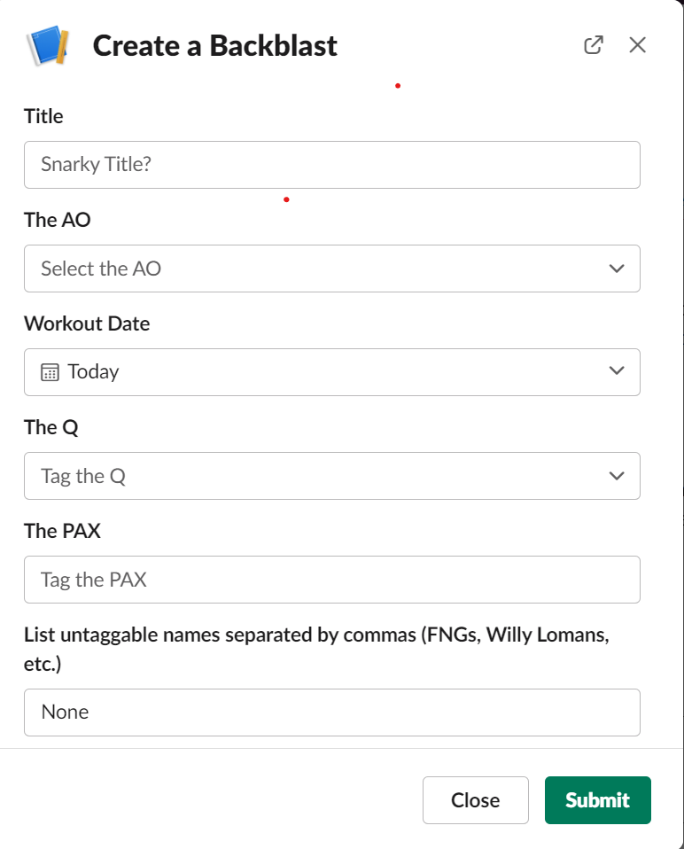
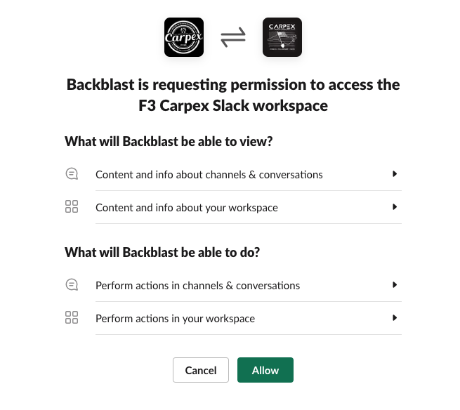
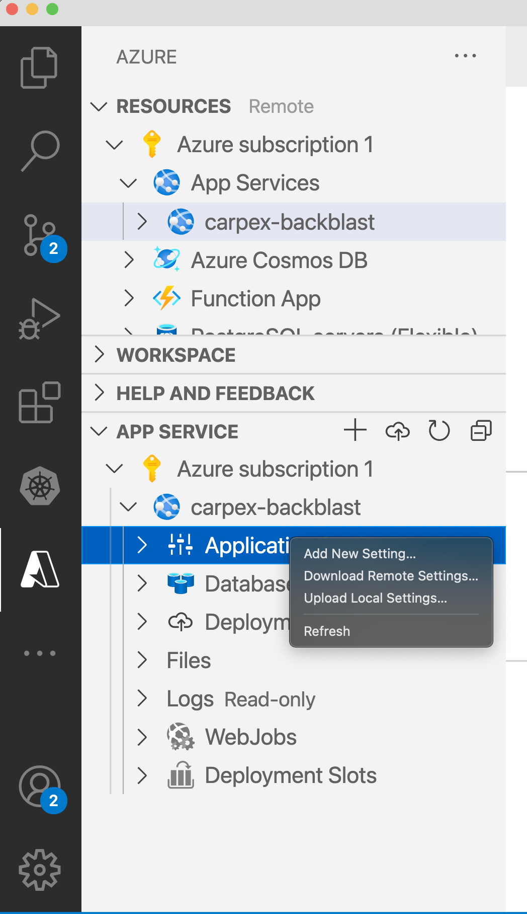

# Slackblast

<!-- ALL-CONTRIBUTORS-BADGE:START - Do not remove or modify this section -->

[](#contributors-)

<!-- ALL-CONTRIBUTORS-BADGE:END -->

Slackblast is an application that you integrate with your F3 region's Slack, compatible with mobile, desktop, and web. This way, anyone in your region can type `/slackblast` and hit send in a Slack channel, and a simple Backblast form pops up, as shown in the following figure. 

> [!TIP]
> For a short tutorial on how to fill out a backblast, you can [share this video](https://www.loom.com/share/705b67bfd30f40ae902fae7a6c1a7421) with the Pax!



## Background

From a technical perspective, Slackblast is a Python web application that utilizes the modal window inside Slack to make posting backblasts easier for PAX. The advantage of this Slackblast app is that it puts the backblast in a format that is compatible with [PAXminer](https://github.com/F3Nation-Community/PAXminer), which makes it easier to compile stats on users each month. The formatted backblast can also be emailed to automatically post to your region's website in WordPress.

The overall flow goes like this:

1. You configure an app for Slackblast in Slack to set up the `/slackblast` command (or a similar name).
2. You configure an app for Slackblast in a cloud server like Microsoft Azure.
3. Pax enter the command `/slackblast` in a channel.
4. The Slack app sends a request to the backend app that runs in your cloud server. 
5. The backend cloud server app responds to tell Slack to open up a modal with the fields to fill out a backblast post. 
6. Pax fill out the backblast and click submit.
7. The information from the backblast form is sent back to the cloud server app. 
8. The cloud server app formats the information in a style that is compatible with Paxminer.
9. The cloud server app sends the information back to the Slack channel that the Pax entered the `/slackblast` command in.

## Before you begin

As part of setting up Slackblast, you will need access to a few different accounts. Although this might seem super techy, you do not need to write any code. Pax who work in tech, like system admins or project managers, would be good people to ask if you need help.

* A [GitHub account](https://github.com/signup) to fork this repo. You will also want a tool to interact with GitHub from your local computer, such as GitHub Desktop and the `git` command line interface (CLI) for the terminal.
* [VScode](https://code.visualstudio.com/) for local development, including enabling the [Azure extension](https://code.visualstudio.com/docs/azure/extensions).
* A cloud account to host the Slackblast app on a server, such as [Microsoft Azure](https://portal.azure.com/). Note that the Azure account and the app service is free, but you will still need a credit card to sign up for it.
* Admin access to your region's Slack account to create a Slackblast app. Particularly, [this backend Slack app site](https://api.slack.com/apps/) that you work with in your browser (not the mobile app you use for mumblechatter and other channels).
* **Optional**: For local devleopment, the following CLI tools installed in your terminal:
  * `git` [docs](https://git-scm.com/book/en/v2/Getting-Started-Installing-Git)
  * `python3` [downloads](https://www.python.org/downloads/)
  * `pip` [docs](https://pip.pypa.io/en/stable/installation/): Note that when you run `pip` commands, you might have to run them through python, such as `python3 -m pip` instead of just `pip`.
  * `gunicorn` [docs](https://docs.gunicorn.org/en/stable/install.html)
  * `ngrok` [docs](https://ngrok.com/download)

## Step 1: Copy the Slackblast app in GitHub

Get your own copy of the Slackblast app in GitHub. This way, you can add the custom settings you need to deploy the app to a cloud server in the next step.

1. [Fork](https://docs.github.com/en/get-started/quickstart/fork-a-repo) this repo in GitHub. Note that you might want to make a separate GitHub organization or use your personal account org for this repo, because you have to authorize your cloud app to it later. 

2. [Clone](https://docs.github.com/en/repositories/creating-and-managing-repositories/cloning-a-repository) the fork to your local working environment so you can make changes to it.

You'll come back to your clone of the app later when you deploy the app to the cloud.

## Step 2: Set up a Slackblast app in Slack

Set up the Slackblast app in Slack. For more help creating a Slack app, [see the Slack docs](https://api.slack.com/start/overview#creating). 

1. Open the [Slack admin portal for apps](https://api.slack.com/apps/). 
2. Click **Create an App**.
3. Enter a name for the app, such as `Backblast`.
4. Set up the scopes that the Slack app needs to post backblasts.
   
   1. From the **Features** section, click **OAuth & Permissions**.
   2. Scroll down to the **Scopes** section.
   3. In the **Bot Token Scopes** section, click **Add an OAuth Scope**.
   4. Repeat the previous step for all of the following scopes.

      ```
      app_mentions:read
      channels:read
      chat:write
      chat:write.public
      commands
      im:write
      users:read
      users:read.email
      ```

5. Get the basic information that you need to configure a cloud app.
   
   1. In the **Settings** section, click **Basic Information**.
   2. Scroll to the **App Credentials** section, and copy the following values:
      * Signing Secret
      * Verification Token
   3. Scroll to the **Display Information** section and configure your app details, such as uploading an icon.

6. Install the app in your Slack workspace.
   
   1. In the **Settings** section, click **Install App**.
   2. Click **Install to Workspace**. 
   3. Review the app actions, which looks like the following figure, then click **Allow**.

   

   1. Now that the app is installed, copy the **Bot User OAuth Token**, in a format such as `xoxb-12345...`

7. Get the Slack channel ID that you want the backblasts to post to.
   1. Open Slack in desktop or web (not mobile).
   2. Go to the channel, such as `#1stf`.
   3. Click the channel name to expand its details.
   4. Scroll down and copy the **Channel ID**, such as `C0...` 

The Slack app is not completely done yet, but you have enough information now to start configuring your cloud app.

## Step 3: Set up a Slackblast app in a cloud server

The following steps are for a free Azure app service. If your region has a different cloud provider, you can adapt these steps accordingly. For more information, see the **Resources** section later in this document.

1. In [Azure](https://portal.azure.com/), go to **App Services**.
2. Click **Create > Web App**.
3. Fill out the **Basics**.
   1. Subscription: You can use the default, such as `Azure subscription 1`.
   2. Resource Group: If you don't have one, you can create one, such as the name of your region.
   3. Name: Give the app a unique name, such as `your-region-backblast`.
   4. Runtime stack: Select a Python 3 runtime.
   5. Pricing plan: From the dropdown, find the `Free F1 (Shared infrastructure)` plan.
   6. Click **Next**.
4. Fill out the **Deployment**.
   1. GitHub Actions settings: Toggle **Enable**.
   2. GitHub account: Click **Authorize**. A pop-up opens to let you sign in to the GitHub account that you used to fork and clone the Slackblast code repo.
   3. Still in the GitHub authorization pop-up, find the organization that your cloned the Slackblast code repo to and click **Grant**.
   4. Click **Authorize AzureAppService**. You are returned back to the Azure > Create Web App > Deployment page.
   5. Organization: Select the organization from the dropdown.
   6. Repository: Select the repo that you forked.
   7. Branch: You can leave this as `main`.
5. Click **Review + create**.
6. Review the details that you just filled out, then click **Create**.
7. After the app finishes creating, click **Go to resource**.
8. Copy the **Default domain**, such as `your-region-backblast.azurewebsites.net`

## Step 4: Deploy the Slackblast code to your cloud app

Now that you have a cloud app set up, deploy the Slackblast code from your forked GitHub repo.

> [!IMPORTANT]  
> The following steps only configure details for Slack. If you also want to use the cloud app for automatically posting to WordPress, see the **Environment Variables** section later in this doc.

1. Follow this [Azure guide](https://learn.microsoft.com/en-us/azure/app-service/deploy-continuous-deployment?tabs=github) to set up automatic deployments from your GitHub repo to the cloud. Azure will create a `main\_<your-azure-appname>.yml` file in the `.github/workflows` folder of your GitHub repo. This file is hidden by default, and you should not need to worry about it. Whenever you make any change to your `main` branch in the GitHub repo, it will deploy the most recent code up to your cloud app.
2. In your local clone of the GitHub repo, pull down the changes that Azure made in your repo, such as by running the following command from the directory in your terminal.
   ```
   git pull
   ```
3. Create an `.env` file in your local clone of the GitHub repo.
4. Open the `.env` file, add the Slack values that you previously gathered, and save the file.
   ```
   SLACK_BOT_TOKEN=<xoxb-12345...>
   SLACK_VERFICIATION_TOKEN=<pPB8...>
   SLACK_SIGNING_SECRET=<f98...>
   POST_TO_CHANNEL=true
   CHANNEL=<C0...>
   ```
5. Sync the environment variables from your local file to your Azure app. You can do this by using the [Azure VScode extension](https://code.visualstudio.com/docs/azure/extensions), or [entering the variables into the web app manually](https://learn.microsoft.com/en-us/azure/app-service/configure-common?tabs=portal#configure-app-settings).
   1. In VScode, click the **Azure** extension.
   2. Expand the **APP SERVICE** menu option.
   3. Expand your Azure subscription, and then your app name, such as `Azure subscription 1 > carpex-backblast` in the following example.
   4. Right-click `Application Settings`, then click **Upload Local Settings**.
   5. In the command pallet at the top of your VScode window, click the `.env` file that you just created. If you do not see the correct filepath, click **Browse** and find your file.
   
   

## Step 5: Configure the Slack app

Now that you have your cloud app deployed, return to your Slack app to finish configuring the Slack app.

1. Open the [Slack admin portal for apps](https://api.slack.com/apps/).
2. Click your Slackblast app.
3. Set up the slash command to trigger the backblast form.
   
   1. From the **Features** section, click **Slash Commands**.
   2. **Command**: Enter the name you want Pax to use to launch the app, such as `/slackblast` or `/backblast`.
   3. **Request URL**: Enter the URL of your cloud app in the following format.
      ```
      https://your-region-backblast.azurewebsites.net/slack/events
      ```
   4. **Short Description**: Brief description of the app, such as `Fill out the backblast form`.
   5. Click **Save**.

4. Set up interactivity so that the cloud app can collect data from the backblast form.
   
   1. From the **Features** section, click **Interactivity & Shortcuts**.
   2. Toggle on **Interactivity**.
   3. **Request URL**: Enter the URL of your cloud app in the following format.
      ```
      https://your-region-backblast.azurewebsites.net/slack/events
      ```
   4. Scroll down to the **Select Menus** section.
   5. **Options Load URL**: Enter the URL of your cloud app again in the following format.
      ```
      https://your-region-backblast.azurewebsites.net/slack/events
      ```
   6. Click **Save Changes**.

Now, the Slack app is configured to send data to your cloud app.

## Step 6: Try it out

You're almost done! Now that everything is set up, you can test out that the command works.

1. Open Slack and go to a channel like `#1stf`.
2. Enter your `/slackblast` command.
3. Fill out the backblast form.

## Environment variables

Slackblast requires the following environment variables:

| Variable                     | Description                                                                                                                                                                                                                                                                                                                                                                                                                                                                                 |
| ---------------------------- | ------------------------------------------------------------------------------------------------------------------------------------------------------------------------------------------------------------------------------------------------------------------------------------------------------------------------------------------------------------------------------------------------------------------------------------------------------------------------------------------- |
| SLACK_BOT_TOKEN              | A value from the token on the OAuth page in the slack app                                                                                                                                                                                                                                                                                                                                                                                                                                   |
| SLACK_VERIFICATION_TOKEN     | A value from the Basic Information -> Verification Token field in the settings for your slack app.                                                                                                                                                                                                                                                                                                                                                                                          |
| SLACK_SIGNING_SECRET         | Secret from the App Credentials page for your app in Slack.                                                                                                                                                                                                                                                                                                                                                                                                                                 |
| POST_TO_CHANNEL              | A boolean value `True` or `False` that indicates whether or not to take the modal data and post to a channel in slack                                                                                                                                                                                                                                                                                                                                                                       |
| CHANNEL                      | The channel id (such as C01DB7S04KH -> NOT THE NAME) you want the modal results to post to by default. other values supported. set to `THE_AO` to post to the channel that was selected in the modal by default. Set to `USER` to post a DM from the slackblast to you with the results (testing) by default. If blank or missing, then the default channel will be the channel the user typed the slash command. In the modal, the user can choose the "destination" and where to post to. |
| EMAIL_SERVER                 | SMTP Server to use to send the email, default is `smtp.gmail.com` so if sending from a gmail account you only need to fill out email_user and email_password email                                                                                                                                                                                                                                                                                                                          |
| EMAIL_SERVER_PORT            | Email server port. default is `465`                                                                                                                                                                                                                                                                                                                                                                                                                                                         |
| EMAIL_USER                   | Email account to send on behalf of                                                                                                                                                                                                                                                                                                                                                                                                                                                          |
| EMAIL_PASSWORD               | Email account password                                                                                                                                                                                                                                                                                                                                                                                                                                                                      |
| EMAIL_TO                     | To send the post to an email address. This will default the choice in the modal but can be changed by user. set `EMAIL_OPTION_HIDDEN_IN_MODAL` to prevent user from changing it.                                                                                                                                                                                                                                                                                                            |
| EMAIL_OPTION_HIDDEN_IN_MODAL | Hide the option from the PAX on sending an email in the modal                                                                                                                                                                                                                                                                                                                                                                                                                               |

<br><br>

## Email for WordPress

All of the email user and password variables will need to be set in order to send an email with the modal contents to the address specified.

## Create WordPress posts by email

WordPress allows you to send a post to a special address via email and it will convert it to a post.

If you are using hosted wordpress set the `EMAIL_TO` address to the random Wordpress email generated by Wordpress, [more information](<https://wordpress.com/support/post-by-email/#:~:text=Go%20to%20My%20Site(s,posts%20by%20sending%20an%20email%E2%80%9D)>).

If you are not using hosted wordpress, then you can create a dedicated gmail or other account and use this address.

See `.env-f3nation-community` file for help on local development.
<br><br>

# Local development

To run locally:

```
pip install -r requirements.txt
gunicorn -k uvicorn.workers.UvicornWorker --bind "0.0.0.0:8000" --log-level debug app:app
```

In another console, use the url output by ngrok to update your slackblast app settings:

```
ngrok http 8000
```

See .env-f3nation-community file for more details on local development
<br><br>

## More resources

Azure
* [Azure App Service product page](https://azure.microsoft.com/en-us/services/app-service/).
* [VSCode Azure Extensions](https://code.visualstudio.com/docs/azure/extensions) will be helpful to upload your own `.env` file with your region's specific Slack and opinionated settings. 
* See how to [integrate your Azure App Service with Github](https://github.com/MicrosoftDocs/azure-docs/blob/master/articles/app-service/deploy-continuous-deployment.md) for easy deployments.

Here is further reading if you want to know what is going on under the hood.

- [Docs for the Azure Web Apps Deploy action](https://github.com/Azure/webapps-deploy)
- [More GitHub Actions for Azure](https://github.com/Azure/actions)
- [More info on Python, GitHub Actions, and Azure App Service](https://aka.ms/python-webapps-actions)

# Contributors ✨

Thanks goes to these awesome PAX ([emoji key](https://allcontributors.org/docs/en/emoji-key)):

<!-- ALL-CONTRIBUTORS-LIST:START - Do not remove or modify this section -->
<!-- prettier-ignore-start -->
<!-- markdownlint-disable -->
<table>
  <tr>
    <td align="center"><a href="https://github.com/wolfpackt99"><br /><sub><b>Trent</b></sub></a><br /><a href="#ideas-wolfpackt99" title="Ideas, Planning, & Feedback">🤔</a> <a href="https://github.com/F3Nation-Community/slackblast/commits?author=wolfpackt99" title="Code">💻</a> <a href="https://github.com/F3Nation-Community/slackblast/commits?author=wolfpackt99" title="Documentation">📖</a> <a href="#mentoring-wolfpackt99" title="Mentoring">🧑‍🏫</a> <a href="https://github.com/F3Nation-Community/slackblast/pulls?q=is%3Apr+reviewed-by%3Awolfpackt99" title="Reviewed Pull Requests">👀</a></td>
    <td align="center"><a href="https://github.com/yankeestom"><br /><sub><b>yankeestom</b></sub></a><br /><a href="#ideas-yankeestom" title="Ideas, Planning, & Feedback">🤔</a> <a href="https://github.com/F3Nation-Community/slackblast/commits?author=yankeestom" title="Code">💻</a> <a href="https://github.com/F3Nation-Community/slackblast/pulls?q=is%3Apr+reviewed-by%3Ayankeestom" title="Reviewed Pull Requests">👀</a></td>
    <td align="center"><a href="https://github.com/willhlaw"><br /><sub><b>willhlaw</b></sub></a><br /><a href="#ideas-willhlaw" title="Ideas, Planning, & Feedback">🤔</a> <a href="https://github.com/F3Nation-Community/slackblast/commits?author=willhlaw" title="Code">💻</a> <a href="https://github.com/F3Nation-Community/slackblast/commits?author=willhlaw" title="Documentation">📖</a> <a href="#projectManagement-willhlaw" title="Project Management">📆</a></td>
    <td align="center"><a href="https://github.com/jim-muzzall"><br /><sub><b>jim-muzzall</b></sub></a><br /><a href="#ideas-jim-muzzall" title="Ideas, Planning, & Feedback">🤔</a> <a href="https://github.com/F3Nation-Community/slackblast/commits?author=jim-muzzall" title="Documentation">📖</a></td>
  </tr>
</table>

<!-- markdownlint-restore -->
<!-- prettier-ignore-end -->

<!-- ALL-CONTRIBUTORS-LIST:END -->

This project follows the [all-contributors](https://github.com/all-contributors/all-contributors) specification. Contributions of any kind welcome!
