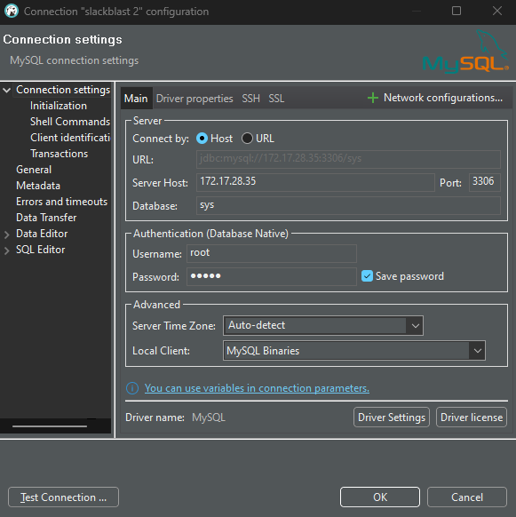

# Slackblast

[](https://github.com/psf/black)

Slackblast is a Slack application you can get up and running in your Slack environment that invokes a simple Backblast form for someone to fill out in the Slack App (mobile, desktop, or web) when they type `/slackblast`, `/backblast`, or `/preblast`. Slackblast interfaces with your PAXminer database directly, and its posts do not need to be scraped by PAXminer (PAXminer will ignore them). If you have not already [set up PAXminer](https://f3stlouis.com/paxminer-setup/), do that first.

Slackblast serves over 100 regions and runs on AWS Lambda - installation is as simple as a [simple link click](#getting-started-), without the need for you to get your own server up and running.

When the user types `/slackblast`, `/backblast`, or `/preblast` and hits send, a window like the one below will pop up:


# Getting started

Installation to your Slack Space is simple. For best results, please make sure you have a working install of PAXMiner in your region.
1. Click [this link](https://n1tbdh3ak9.execute-api.us-east-2.amazonaws.com/Prod/slack/install) from a desktop computer
2. Make sure to select your region in the upper right if you are signed into multiple spaces

To use, simply type `/slackblast`, `/backblast` or `/preblast` from any channel and a form should come up.
                                                                         
# Slack App Configuration

Slackblast has a number of region-configurable settings. To access and set these, use the `/config-slackblast` command.

## Strava Integration

When enabled, slackblast will put a "Connect to Strava" button on the post, which tagged users can use to connect the slackblast to an existing Strava activity. When clicked, the following process is used:
- If the user has not used this button before, they will be prompted to allow Slackblast access to their Strava account
- Otherwise, a list of recent Strava activities will be shown to the user, which they select
- On the next screen, the user can modify the title / text of the Strava activity, which defaults to the title / moleskine of the Slackblast post
- After closing / submitting, Slackblast will make a callout in the post thread, recording how far the PAX traveled and how many calories they burned

## Custom Fields

Slackblast now allows regions to add fields to backblasts for other things they might want to track. For example, you could track the distance traveled, calories burned, or the category of F3 activity the post is for. This information will be stored in JSON format alongside the backblast, which can later be queried with MySQL's JSON functions (https://dev.mysql.com/doc/refman/8.0/en/json.html). I'll provide some examples / tutorials soon.

To get started, click the Enable / Edit Custom Fields button in `/config-slackblast`. This will bring up a secondary menu where you can add / delete / edit / enable new fields. Once added and enabled, Custom Fields will be added to the bottom of your Slackblast forms.

## Create Posts by email

Wordpress allows you to send a post to a special address via email and it will convert it to a post. If you are not using hosted wordpress, then you can create a dedicated gmail or other account and use this address. The `/config-slackblast` menu allows you to set a email server, port, address, and password to the email account you would like the email to come from (gmail is probably best), as well as the email-to-post address you would like it to go to. For those using Postie, you can also enable a format so that users are tagged and the AO is used as a category.

## Lock Editing of Backblasts

If enabled, this will lock down editing of backblasts to the Q / Co-Qs, the original poster, or Slack admins.

## Moleskine Templates

These templates will serve as the default when your users start a new backblast or preblast.

# FNG Welcome Message

Slackblast now has functionality to welcome new users (FNGs) into your region's Slack Space! This will trigger automatically as soon as new users join. To configure, use the `/config-welcome-message`. There are two things to enable:

1. **Welcome DMs:** These will be sent to the user via a direct message. You can set your region's template in the editor. This is a good place to help your FNG navigate your Slack space, where to go for help, terminology, etc.
2. **Channel Welcome Posts:** These are shout-outs in a channel of your choosing. When enabled, this will welcome your user in a fun message, letting the rest of your guys welcome them as well.


# Contributing

Slackblast is in active development, and I welcome any and all help or contributions! Feel free to leave an [Issue](https://github.com/F3Nation-Community/slackblast/issues) with bugs or feature requests, or even better leave us a [Pull Request](https://github.com/F3Nation-Community/slackblast/pulls).

## Local Development

If you'd like to contribute to Slackblast, I highly recommend setting up a local development environment for testing. Below are the steps to get it running (I did this in unix via WSL on Windows, YMMV on OSX):

### Development Environment:

If you don’t have a development environment of choice, I’m going to make two strong recommendations; VSCode is a VERY good and free IDE, and I would strongly make the case for using a unix environment.

1. **VSCode:** [Download Visual Studio Code - Mac, Linux, Windows](https://code.visualstudio.com/download)
2. **Unix environment:** if on Windows 10+, you can enable “Windows Subsystem for Linux” (WSL), that will allow you to run a version of linux directly on top of / inside of Windows. VSCode makes it very easy to “remote” into WSL: [Install WSL](https://learn.microsoft.com/en-us/windows/wsl/install) (I use Ubuntu FWIW).
3. **Python 3.12:** you may already have this, but if not I recommend pyenv to manage python installations: [pyenv/pyenv: Simple Python version management](https://github.com/pyenv/pyenv?tab=readme-ov-file#installation). Specifically, Slackblast currently uses **Python 3.12**
4. **MySQL 8:** all of my apps use Beaker’s PAXMiner MySQL 8 instance on AWS RDS in prod, so I would recommend having a local MySQL instance for local development purposes. The easiest way I found to do this was through Docker, which comes pre-installed in most unix environments [How to Run MySQL In A Docker Container (howtogeek.com)](https://www.howtogeek.com/devops/how-to-run-mysql-in-a-docker-container/)
    - Note, I had to modify some of these steps to accomodate WSL, here's what I ran (where MYDB and MYPASS are of your choosing, remember these for later!):
```sh
echo "bind-address = 0.0.0.0" >> /root/docker/f3dev/conf.d/mysqld.cnf
docker run --detach --name=MYDB --env="MYSQL_ROOT_PASSWORD=MYPASS" --publish 3306:3306 --volume=/root/docker/f3dev/conf.d:/etc/mysql/conf.d --volume=$HOME/mysql-data:/var/lib/mysql mysql
```
5. **Ngrok:** you will use this to forward network traffic to your locally running development app: [Download (ngrok.com)](https://ngrok.com/download). You will need to create a free account and install your authtoken: [Your Authtoken - ngrok](https://dashboard.ngrok.com/get-started/your-authtoken)
6. **Poetry:** I use Poetry for of my apps’ dependency / environment management: [Introduction | Documentation | Poetry - Python dependency management and packaging made easy (python-poetry.org)](https://python-poetry.org/docs/)
7. **Git:** Git should be installed in most unix environments, here’s unix: [Git (git-scm.com)](https://git-scm.com/download/linux)
8. **Nodemon:** this is a useful utility for having “hot reload” when you’re developing: [nodemon - npm (npmjs.com)](https://www.npmjs.com/package/nodemon). You will likely need to install npm: [How to install Node.js and NPM on WSL2 (cloudbytes.dev)](https://cloudbytes.dev/snippets/how-to-install-nodejs-and-npm-on-wsl2)
9. **VSCode extensions:** one of the best things about VSCode are the thousands of extensions that are available to help your coding experience
    - Once you will need for sure:
      - WSL (if using WSL)
      - Remote Explorer (may come with the one above)
      - Python Extention Pack
    - Some other favorites of mine
      - Github Copilot - has blown my mind on how good it is, but it is $10 a month
      - Gitlens
      - Error Lens
      - Ruff
      - Black Formatter

### Project setup

1. Clone the repo:
```sh
git clone https://github.com/F3Nation-Community/slackblast.git
```
2. Use Poetry to install dependencies:
```sh
cd slackblast
poetry env use 3.12
poetry install
```
3. Create your development Slack bot: 
    1. Navigate to [api.slack.com]()
    2. Click "Create an app"
    3. Click "From a manifest", select your workspace
    4. Paste in the manifest below
    5. After creating the app, you will need a couple of items: first, copy and save the Signing Secret from Basic Information. Second, copy and save the Bot User OAuth Token from OAuth & Permissions

```yaml
display_information:
  name: slackblast-dev
  description: An invokable form to produce properly-formatted backblasts and preblasts
  background_color: "#000000"
features:
  bot_user:
    display_name: slackblast-dev
    always_online: true
  slash_commands:
    - command: /slackblast
      url: https://YOUR-URL.ngrok-free.app/slack/events # You'll be editing this
      description: Launch backblast template
      should_escape: false
    - command: /preblast
      url: https://YOUR-URL.ngrok-free.app/slack/events # You'll be editing this
      description: Launch preblast template
      should_escape: false
    - command: /config-slackblast
      url: https://YOUR-URL.ngrok-free.app/slack/events # You'll be editing this
      description: Configures your region's instance of slackblast (email settings, etc)
      should_escape: false
    - command: /backblast
      url: https://YOUR-URL.ngrok-free.app/slack/events # You'll be editing this
      description: Launch backblast template
      should_escape: false
    - command: /config-welcome-message
      url: https://YOUR-URL.ngrok-free.app/slack/events # You'll be editing this
      description: Opens a configuration menu for FNG welcome messages
      should_escape: false
    - command: /tag-achievement
      url: https://YOUR-URL.ngrok-free.app/slack/events # You'll be editing this
      description: Lauches a form for manually tagging Weaselbot achievements
      should_escape: false
    - command: /send-announcement
      url: https://YOUR-URL.ngrok-free.app/slack/events # You'll be editing this
      description: Triggers a announcement send
      should_escape: false
oauth_config:
  redirect_urls:
    - https://YOUR-URL.ngrok-free.app/slack/install # You'll be editing this
  scopes:
    user:
      - files:write
    bot:
      - channels:history
      - channels:read
      - chat:write
      - chat:write.customize
      - chat:write.public
      - commands
      - files:read
      - im:history
      - im:read
      - im:write
      - team:read
      - users:read
      - files:write
settings:
  event_subscriptions:
    request_url: https://YOUR-URL.ngrok-free.app/slack/events # You'll be editing this
    bot_events:
      - team_join
  interactivity:
    is_enabled: true
    request_url: https://YOUR-URL.ngrok-free.app/slack/events # You'll be editing this
  org_deploy_enabled: false
  socket_mode_enabled: false
  token_rotation_enabled: false
```
4. Copy `.env.example`, replacing `ADMIN_DATABASE_PASSWORD` with the one you used to set up MySQL, `SLACK_SIGNING_SECRET` and `SLACK_BOT_TOKEN` from your Slack setup above, and save the new file as `.env` in the base directory
5. Initialize your local database by running the script:
```sh
cd slackblast # if not already in the slackblast subdirectory
source ../.env && poetry run python utilities/database/create_clear_local_db.py
```
6. Run Ngrok with the following command from your terminal:
```sh
ngrok http 3000
```
7. Copy the Forwarding URL (has `ngrok-free.app` at the end)
8. Back in your browser for the Slack app, replace **all** of the YOUR_URLs with the ngrok Forwarding URL
9. You are now ready to roll! This would be a good time to make sure you're on your own branch :)
10. To run the app with "hot reload" (restarts anytime you save a file), run from the slackblast subdirectory:
```sh
source ../.env && nodemon --exec "poetry run python app.py" -e py
```
11. Use ctrl-C to stop both Ngrok and nodemon
12. Repeat steps 6-11 whenever you stop and want to come back to your app

If you want to access your db through dbeaver, you can set it up like a normal db connection. Note, if using WSL, your WSL's IP address CAN CHANGE, meaning you would need to edit your connection when it does. I got the Server Host port number by running `wsl hostname -I` from Powershell from Windows.


